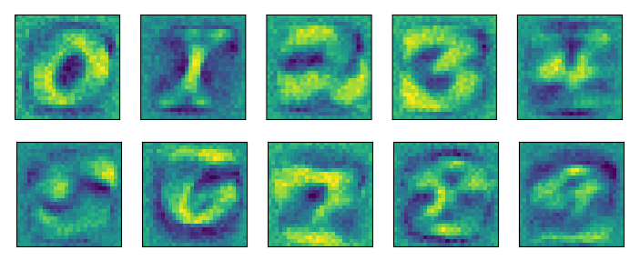

# Kaggle: Digit Recognizer

> Linear Classifier: The most basic Neural Network for Image Classificiation, but with real explainability.

## Explainability
Visual representation of the weights for each linear classifier's neuron:

*The brighter the pixel, the greater the weight.*

## Performance
Unfortunately, it has not the best accuracy.

| Metric   | Value   |
|----------|---------|
| Accuracy | 0.89232 |
